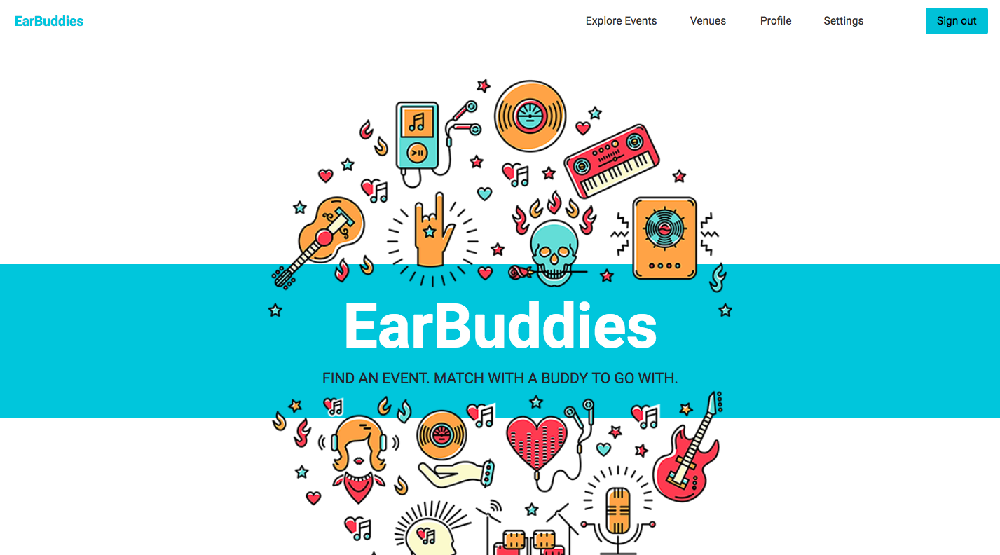
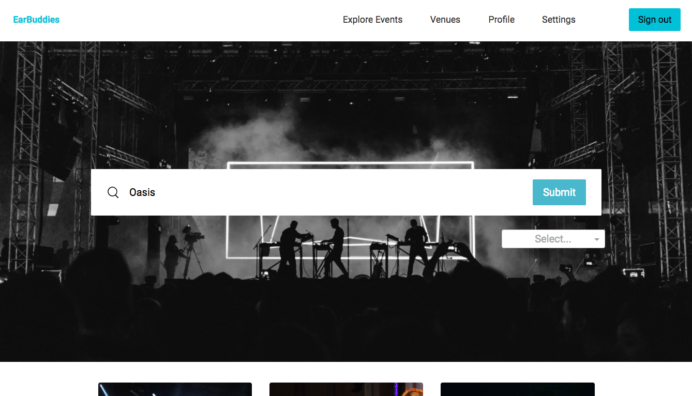
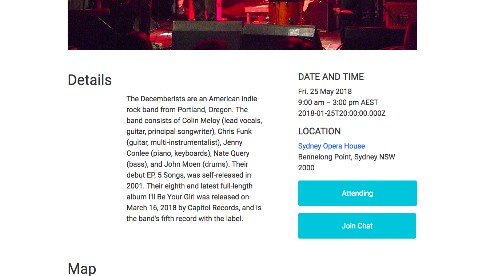
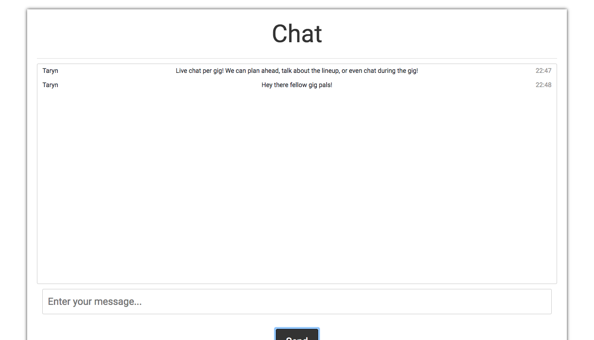

# Project 2 - EarBuddies
### Collaboration between [Ryan Liu](https://github.com/shiang), [Mac Radinoff](https://github.com/mradinoff), [Joseph Ocampo](https://github.com/joseph-michael) & [Taryn Ewens](https://github.com/tarynelise).

See it in action here: https://earbuddies-react.herokuapp.com/

It is a social media platform allowing users to find events, see who's attending and "match" with a friend Tinder style, as well as live chat with the other attending users of the event.

## How to use
- Follow the sign up link to create an account, then update your profile.
- Explore events you might like to attend. Click "attending" to add yourself to the attending list.

- Take a look through other people attending and "like" the people you would like to hang out with at the event.
- Changed your mind? You can unlike them too!

- If they like you back, they'll show up in your friends list but don't worry - you can always remove them if need be! No pressure "friendships". Did they not like you? Did they just not see you were attending? You can't be offended, because you'll never know!

- Click the "Join Chat" button on each event to enter that events live chat and see what others are saying about the event!

## Objectives
- Models. App should have at least 3 models. Make sure they are associated correctly!
- Views. Use partials to DRY (Don’t Repeat Yourself) up the views.
- Handles invalid data. Forms in the application should validate data and handle incorrect inputs. Validate sign up information, verify valid email addresses and secure passwords.
- Use Gems Use a GEM that talks to an API to add functionality to the app.
- User Login. Make sure there is basic authentication and authorization set up.
- Heroku. Deploy code to Heroku.

## Built With
- HTML
- CSS
- React
- Ruby on Rails
- Bootstrap

## Scope
EarBuddies - Find buddies to go to a gig with!
Features will include;
- Sign up
- Sign in via email address
- Set up profile with photo, name, bio etc.
- View own profile, including attending events and "matched" friends
- Like other users to "match" with them
- Find events and say you're attending
- Search events via genre, and use geolocation to show events near you
- Live chat with other users for that event. Make plans before the event, discuss the gig, chat during the gig!
- Edit profile

## Object models
- User has and belongs to many events. Has many friends through friendships. Has many messages.
- Event has and belongs to many users. Belongs to a venue.
- Venue has many events.
- Message belongs to user, and belongs to event.
- Friendship belongs to user, and friend (user).

## Approach

Our approach for this project was firstly to find a topic all group members had a common interest in, and discussed our life hopes and dreams, before deciding on our idea for the app.

We initially focused on the back end and planning out our main features and the models they would require. We worked together to get the rails back end up and running, although many extra migrations were needed later to refactor once we realised some of our theories didn't quite work in practise (eg. "friendships" that needed to be "matched" Tinder style).

We ensured our ajax requests were working via Postman, before implementing the front end so we knew we could get the data that we needed.

With Ryan being an expert in React, we braved tackling React for our front end. This was a huge learning experience for the rest of us, and a lot of our week was spent figuring our how to pass the right data to the right components.

We realised halfway through this week that we had been a little too ambitious with our original idea, where we were attempting to build basically a meet up app, a tinder for friends app, as well as a chat application. Whoops! We had to refocus our efforts on the most important functionality.

Due to this, we had to put our one on one messaging we'd hoped for between users on hold. We ran out of time to get this up and running, but are hoping to add this in later with the use of the PostBox gem.

One of our biggest (unexpected) challenges was the friendships model, and how to "match" friends. There was a lot of logic involved, and the code got a little messy with many if statements that hopefully we can refactor in the future with more experience.

We worked really well as a group this week, and although we weren't overly organised (our Trello board was forgotten about after a couple of days), we communicated well and managed to split up tasks, work together when needed, and keep focused on the end goal.

Our group conclusion is that React is hard (except for Ryan who had the time of his life this week).

We plan to continue working on this with our to do list below.

## To do:
- [ ] One on one direct messaging between matched friends
- [ ] Interactive google map on event page
- [ ] Improve search function
- [ ] Backend access for venues to upload their events
- [ ] Be able to view friends profiles
- [ ] Make responsive

## License
This project is licensed under the MIT license.

## Acknowledgments
Thanks to Joel, John and Theo @ General Assembly for the help.

This project was undertaken as part of the General Assembly Sydney's WDI 26 course, April 2018.
